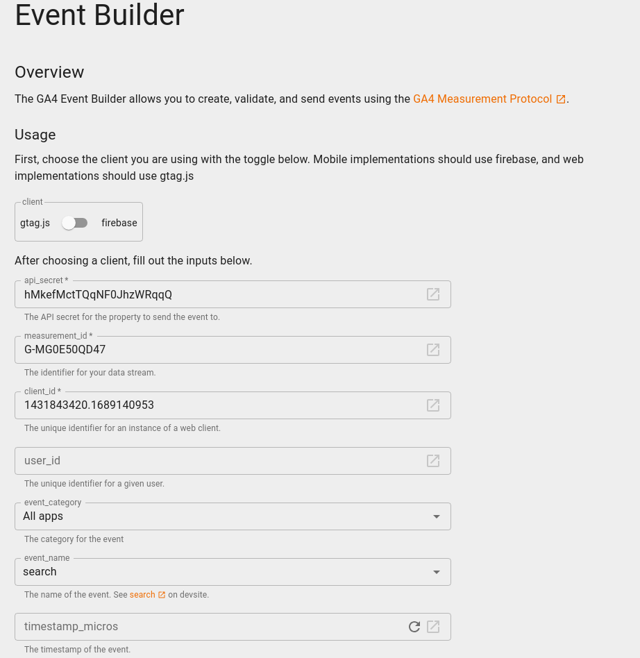
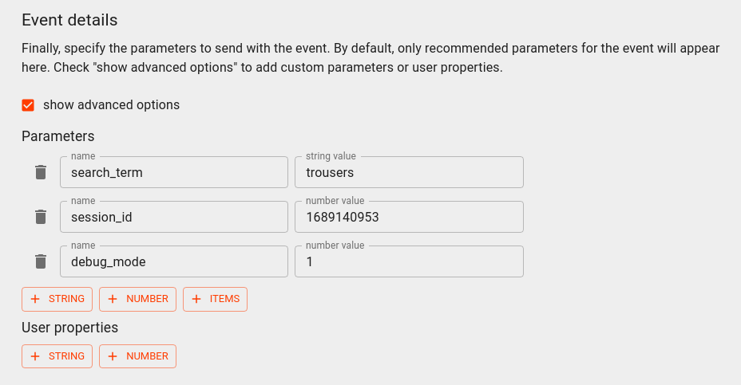
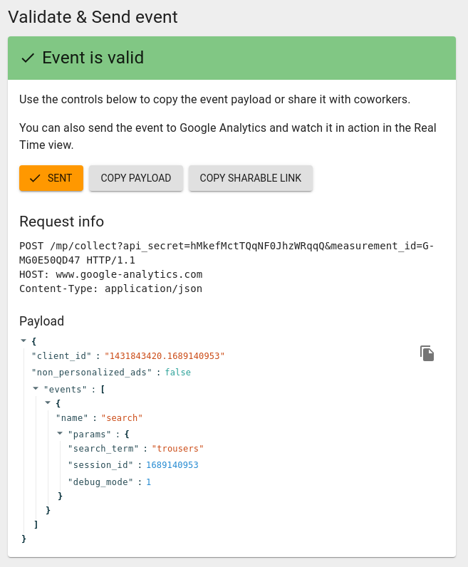
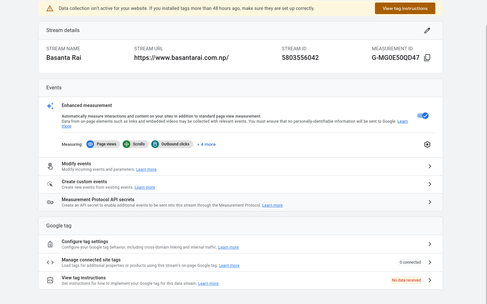
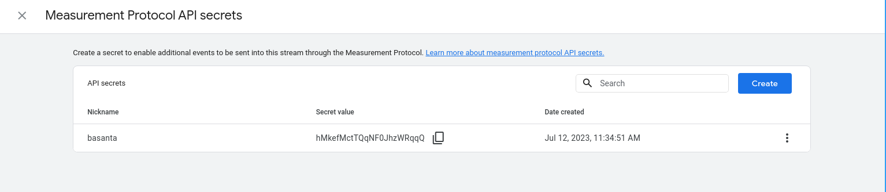
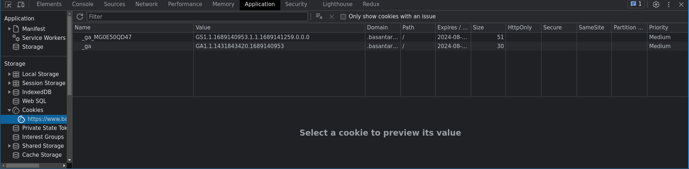
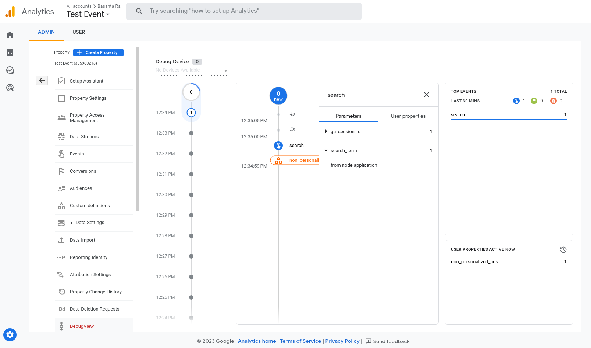

# Send events to GA4 via Measurement Protocol

### Steps:

1. Install google tag in our website that we want to track

```html
<!-- Google tag (gtag.js) -->
<script
  async
  src="https://www.googletagmanager.com/gtag/js?id=G-MG0E50QD47"
></script>
<script>
  window.dataLayer = window.dataLayer || [];
  function gtag() {
    dataLayer.push(arguments);
  }
  gtag("js", new Date());

  gtag("config", "G-MG0E50QD47");
</script>
```

2. Go to [google analytics event builder](https://ga-dev-tools.google/ga4/event-builder/) and login with our google account

3. We will see a form to fill this we need `api_secret`, `measurement_id` and `client_id`

   
   
   

4. To collect `measurement_id` go to Admin -> Choose Property -> Data streams -> and choose an web application here you can see `measurement_id`

   

5. To collect `api_secret` in the same location as above click on Measurement Protocol API secrets, here we can create new if we don't have any or see the existing secret value that is our `api_secret`

   

6. After that we can get our `client_id` from cookie, `client_id` is two largest number values held by key `_ga`
   

7. After this collect `Request info` to use in our application from **Validate and Send event** in our form
8. Create a node application to send event to our GA

```javascript
const express = require("express");
const app = express();
const axios = require("axios");

const payload = {
  client_id: "1431843420.1689140953",
  non_personalized_ads: false,
  events: [
    {
      name: "search",
      params: {
        search_term: "from node application",
        session_id: 1689140953,
        debug_mode: 1,
      },
    },
  ],
};

try {
  axios({
    method: "post",
    url: "https://www.google-analytics.com/mp/collect?api_secret=hMkefMctTQqNF0JhzWRqqQ&measurement_id=G-MG0E50QD47",
    data: payload,
  });
} catch (error) {
  console.error(error);
}

app.listen(3000, () => {
  console.log(`listening on port 3000`);
  console.log(`http://localhost:3000`);
});
```

8. Once the application is set, run this application to send request
9. After that we can observe sent event in our `DebugView`
   

### Resources

- [guide to integrate google analytics with node](https://www.tutscoder.com/post/use-google-analytics-reporting-api-nodejs)
- [interact with the googne analytics api using nodejs](https://flaviocopes.com/google-analytics-api-nodejs/)
- [Integrating with google analytics](https://cloud.google.com/appengine/docs/flexible/integrating-with-analytics?tab=node.js#top)
- [How to Track Events with Google Analytics 4 and Google Tag Manager](https://www.analyticsmania.com/post/how-to-track-events-with-google-analytics-4-and-google-tag-manager/)
- [Google Analytics 4 Measurement Protocol || Send events to GA4 via Measurement Protocol ](https://www.youtube.com/watch?v=r_eoeU2qUn0)
